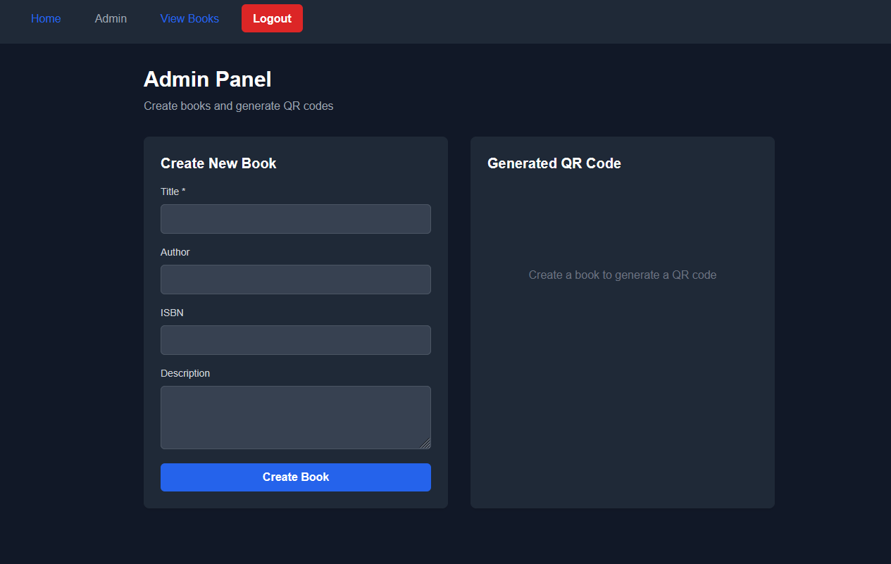
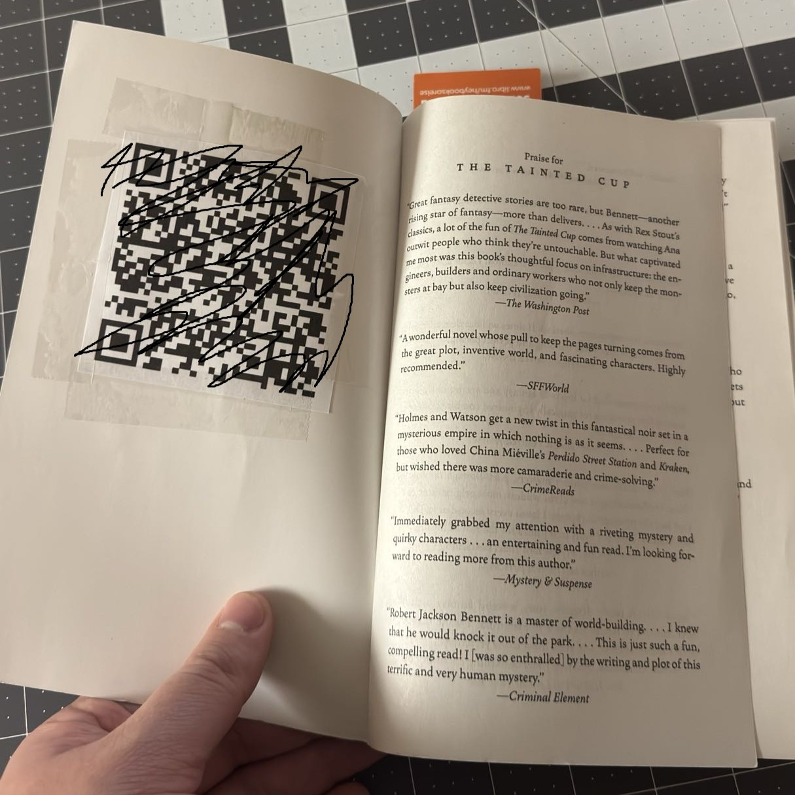
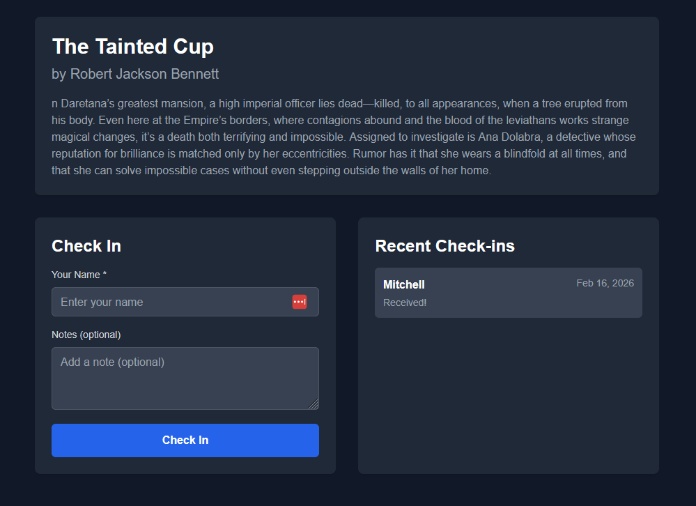

## Project Overview
Every now and then I lend a book to a friend that I know they would enjoy, 
however maybe a few months pass and I forget about this exchange. 

I then will suggest the book to another friend and want to lend them said book but forget where I sent it off to. 

So I wanted to create a simple way for people to externally "check-in" they have a book of mine. 
The approach was to simply have a QR code taped into a book to allow for anyone with said book to essetially "confirm" they are the current reader of the book.

---

## Tech stack
At the time of making this, my friend was beginning development on his website [Tiltspin](https://tiltspin.com/). I indicated my interest in his project and he more than gladly accepted some help. I wanted to further my understanding of his stack so that influenced the stack of this project  

The stack is:
- Next.js
- Express.js
- Postgresql
- GCP
- Docker

---

## Process Flow
Kicks off with me suggesting a book to a friend and offering to mail it to them. From there I can log into the admin panel for the app.

After I input the information for my book, The tainted cup I will be given a QR code which I print out and simply tape into the book

After this step I simply give to my friend either through the mail or in person. Some friends seem to be using it!

---

## Thoughts
I enjoyed the process of making this. I think a lot of people will ask if it was worth the effort. I believe it was. While the functionality is simple I appreciate being able to make a small tool.

### Ideas
I could expand on this project in a multitude of ways.
- Add in all books I own, create a libary system that allows friends to requrest a book from me.
- Create a dashboard that allows me to see how many books I have sent off
- Add more options on the qr code, such as "reviews" that way a user can simply scan the qr and choose to either "check-in" or "leave a review"

I don't see myself working on many of these in the near future, but its nice to leave these ideas here in case I ever come back to it!

